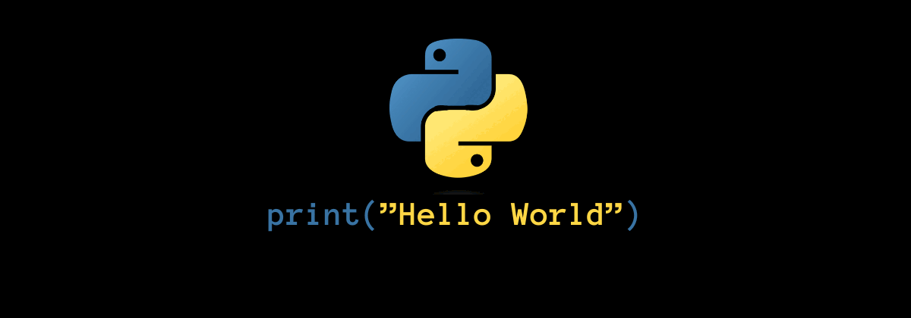

<picture>
  
</picture>


<h1 align="center"> What I'm learning: </h1>
<p align="center">
  ```<br>
    🐍 Python ( Intermediate -> Advanced ) <br>
    🦀 Rust ( beginner ) <br>
    ☕📜 Javascript ( beginner ) <br>
    ⚛ React ( Intermediate ) <br>
    🔵 C++ ( Intermediate ) <br><br>  
  ```
</p>
<p align="center">Also studying physics</p>
<hr>
<h2 align="center"> Current projects: </h2>
<p align="center">Bushcraft information repository & Map <br>Learning C++ for gamedev and to build compilers <br>Learning how to build operating systems in rust</p>
<hr>
<h2 align="center">Github stats :bar_chart:</h2>

<h4 align="center">Visitor's count :eyes:</h4>
<p align="center"></p>

<h4 align="center">Top langs :scroll:</h4>

<p align="center"></p>

<h4 align="center">Profile stats :star:</h4>

<p align="center"></p>
